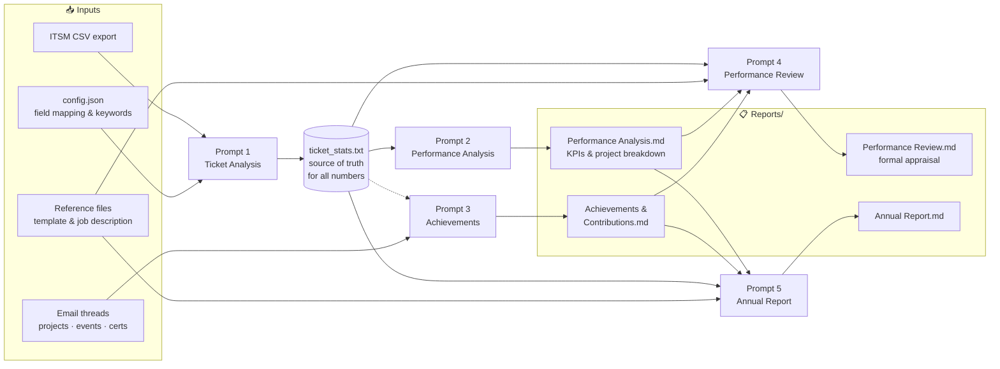
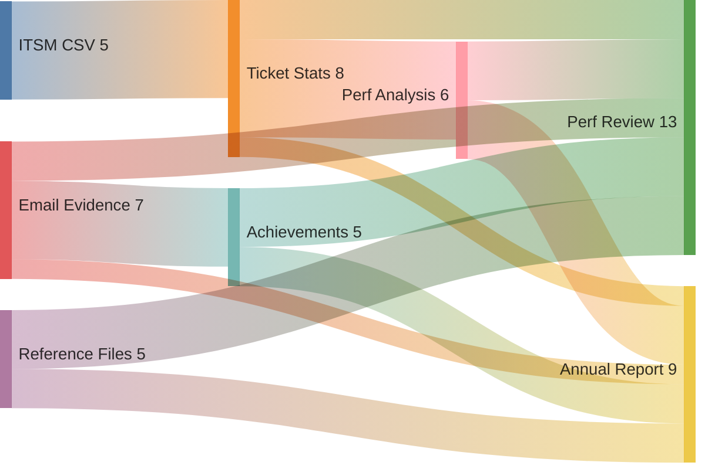

# it-eval-kit

Turn your ITSM ticket export and email evidence into a polished performance review in under 30 minutes — no manual pivot tables, no blank-page anxiety. A local, privacy-preserving toolkit for IT service desk professionals using VS Code + AI chat.

---

## ✨ What it does

1. 🎯 **Classifies and analyses** your ITSM ticket export — resolution rates, category breakdown, deployment counts, peak periods
2. 📧 **Audits your email evidence** — project threads, events and meetings, certifications
3. 📝 **Generates and updates** four report types via structured AI prompts: Performance Analysis, Achievements & Contributions, Performance Review, and Annual Report

All classification logic and ITSM field mappings live in a single `config.json` file — no code changes required to adapt to your organization's system.

---

## 🔄 Pipeline



> 📌 **Starting a session?** Run `0-orchestrator.prompt.md` in Copilot Agent chat — it walks you through the full update end-to-end, in the right order.

**Evidence sources → intermediate artifacts → final reports:**



---

## 🛠️ Prerequisites

- 🐍 Python 3.8 or later
- 💻 [VS Code](https://code.visualstudio.com/) with [GitHub Copilot](https://marketplace.visualstudio.com/items?itemName=GitHub.copilot-chat) (or any AI chat tool that can read workspace files — see [Without GitHub Copilot](#-without-github-copilot))
- 📤 A ticket export from your ITSM system (ManageEngine, Jira, ServiceNow, or any CSV-based export) *(optional — the tool also works with email evidence only)*
- 📧 Email threads exported as plain text *(optional — for project, event, and achievement evidence)*

---

## 📋 What Your CSV Needs to Contain

Your ITSM ticket export needs at least these columns (exact names don't matter — you'll map them in `config.json`):

| Field | Required | Purpose |
|---|---|---|
| Subject / Title | Yes | Ticket description — used for keyword classification |
| Status | Yes | Closed / Resolved / Canceled / Open |
| Requester / Caller | Yes | For unique user count |
| Created date | Yes | For time calculations and monthly breakdown |
| Resolved date | Yes | For resolution time; blank = still open |
| Category / Subcategory | Recommended | If your ITSM assigns these reliably, include them — the setup prompt can use them to build your `categories` config automatically |

> 💡 **Before exporting:** If your ITSM has a Category or Subcategory field and the values are accurate and consistently applied, select those columns in your export. The `setup.prompt.md` will detect them and use them to build your classification config — no manual keyword writing needed. If those fields are absent or inconsistently filled, the setup prompt will infer categories from ticket subjects instead.

---

## ⚡ Quick Start (with sample data)

```bash
# Clone the repo
git clone https://github.com/5a9awneh/it-eval-kit.git
cd it-eval-kit

# Run the sample data through the analyser
python Tools/analyze_tickets.py Evidence/sample/sample_tickets.csv
```

Output is written to `Tools/ticket_stats.txt`. Compare against `Evidence/sample/sample_ticket_stats.txt` to verify everything is working.

---

## 🚀 Setting Up for Your Data

### Step 1 — Configure for your ITSM system

Run `setup.prompt.md` in Copilot Agent chat — it reads your CSV directly, identifies your column layout and date format, and writes `Tools/config.json` for you automatically.

<details>
<summary>Configure manually instead</summary>

Open `Tools/config.json` and update:

| Setting | What to change |
|---|---|
| `csv_columns` | Column indices for subject, status, requester, created, resolved in your CSV (0-indexed) |
| `csv_header_rows` | Number of non-data rows at the top of your export file |
| `date_format` | Date format in your created/resolved columns (e.g. `%m/%d/%Y %I:%M %p`) |
| `status_resolved`, `status_cancelled` | Exact status label strings used by your ITSM for closed/resolved and canceled tickets |
| `categories` | Keyword patterns for each ticket category — add, remove, or rename to match your environment |

The sample config ships with ManageEngine SDP defaults. Run with `--validate` to see how tickets are being classified and tune patterns as needed.

**Common ITSM column mappings** (0-indexed; verify against your own export's header row):

| ITSM Tool | subject | status | requester | created | resolved | header_rows |
|---|---|---|---|---|---|---|
| ManageEngine SDP | 1 | 2 | 3 | 6 | 7 | 4 |
| Jira Service Management | 1 | 2 | 4 | 6 | 7 | 0 |
| Freshdesk | 1 | 3 | 4 | 5 | 6 | 0 |
| ServiceNow | 2 | 3 | 5 | 6 | 7 | 0 |

These are representative starting points. Always open your CSV and count columns from 0 to confirm before running.

</details>

### Step 2 — Place your Reference files

Add these files to `Reference/` (they are git-ignored — they stay local only):

| File | Purpose |
|---|---|
| `role-description.txt` | Your job description or terms of reference |
| `performance-review-template.txt` | Your org's appraisal form, pasted as plain text |
| `sample-completed-review.md` | (Optional) A previous review as a tone reference |

See `Reference/README.md` for details.

### Step 3 — Personalise the AI instructions

Open `.github/copilot-instructions.md` and fill in the placeholders:
- `{YOUR_NAME}`, `{YOUR_TITLE}`, `{YOUR_ORGANIZATION — DEPT}`, `{YOUR_SUPERVISOR_NAME}`, `{GRADE/LEVEL/CONTRACT}`

### Step 4 — Organise your evidence

Place files in `Evidence/` (git-ignored — local only):

```
Evidence/
  tickets/                     ← ITSM CSV exports
  email-evidence/
    projects-initiatives/      ← One .txt file per project email thread
    events-meetings/           ← Events, meetings, and presentations you attended, organized, or supported
    learning-certs/            ← Certificates and training completions
```

#### Exporting email evidence from Outlook

The `ExportEachConversationToTxt.bas` file in `Tools/` is a VBA macro that exports selected email conversations to plain text files automatically.

**To set up and run the macro:**

1. In Outlook, open the VBA editor: **Alt + F11**
2. In the Project Explorer (left panel), expand **Project1** → right-click **Modules** → **Insert → Module**
3. Open `Tools/ExportEachConversationToTxt.bas` in a text editor, copy all contents, and paste into the new module
4. Close the VBA editor (**Alt + F4**)
5. Back in Outlook, select the email threads you want to export (pre-filter by sender or subject first)
6. Run the macro: **Alt + F8** → select `ExportEachConversationToTxt` → **Run**

Exported files are saved to `Documents\OutlookExport\`. Move them into the appropriate `Evidence/email-evidence/` subfolder.

> 💡 **Pre-filter tip:** Before selecting emails to export, narrow down to relevant threads first. Common methods in Outlook:
> - **Search folders** — create a saved search for a sender, keyword, or date range
> - **Subject search** — search by project name, event title, or keyword in the subject line
> - **Sender filter** — filter by a manager, stakeholder, or team address who sent acknowledgments or project updates
> - **Categories** — if you've tagged emails with Outlook categories (e.g. "Projects", "Certificates"), filter by category
> - **Flags** — if you flagged key emails during the year, filter by flagged items
>
> Export only what's relevant to your reporting period. Exporting your full inbox is neither necessary nor recommended.

---

## ▶️ Running the Analysis

The recommended way is via Copilot Agent chat — run `1-analyze-tickets.prompt.md`, which verifies your config, runs the script, checks the output, and reports key numbers back to you.

To run the script directly instead:

```bash
# Basic run
python Tools/analyze_tickets.py Evidence/tickets/your-export.csv

# Validate classification only — no output file written (use when tuning config.json)
python Tools/analyze_tickets.py Evidence/tickets/your-export.csv --validate

# With per-ticket classification output
python Tools/analyze_tickets.py Evidence/tickets/your-export.csv --verbose

# Custom config file
python Tools/analyze_tickets.py Evidence/tickets/your-export.csv --config path/to/config.json
```

Output: `Tools/ticket_stats.txt` — this is the source of truth for all report numbers.

> 💡 Use `--validate` when tuning your `config.json` categories: it shows how every ticket is classified and lists all unmatched tickets, without overwriting your existing `ticket_stats.txt`.

---

## 📊 Generating Reports

Open VS Code and start a Copilot Agent chat. To run a prompt, use any of these methods:

- **Slash command** — type `/` in the chat input → select the prompt by name from the dropdown
- **Run button** — open the `.prompt.md` file in the editor → click the ▶ **Run Prompt** button in the top-right toolbar
- **File reference** — type `#` in the chat input, select the prompt file, then send

---

### � First-time setup — run once

| Prompt | Purpose |
|---|---|
| `setup.prompt.md` | Reads your CSV, auto-configures `Tools/config.json` — column mapping, date format, status values, and categories |

Run this once when you first clone the repo, or again if you switch to a different ITSM system.

---

### 🔁 Full update — start here for every session with new data

Run `0-orchestrator.prompt.md` for any session where you have new data. It:
- Asks you to set supervisor mode for the session
- Assesses what has changed (new CSV? new email evidence?)
- Runs the required prompts in the correct order
- Performs final checks and reminds you to commit

---

### 📋 Individual prompts — run directly if only one section needs updating

| Step | Prompt | What it updates | Needs |
|---|---|---|---|
| 1 | `1-analyze-tickets.prompt.md` | `ticket_stats.txt` | New CSV in `Evidence/tickets/` |
| 2 | `2-performance-analysis.prompt.md` | `Performance Analysis.md` | `ticket_stats.txt` |
| 3 | `3-achievements.prompt.md` | `Achievements & Contributions.md` | Email evidence *(ticket data optional)* |
| 4 | `4-performance-review.prompt.md` | `Performance Review.md` | Prompts 2 & 3 complete |
| 5 | `5-annual-report.prompt.md` | `Annual Report.md` | Prompts 2 & 3 complete |

> **No ticket data?** If your role is primarily project or event-based and you have no CSV export, skip Prompt 1 entirely. Prompt 3 (Achievements) works on email evidence alone. Prompts 2, 4, and 5 will produce partial outputs with a note where ticket metrics would appear — all other sections remain fully populated.

---

### Supervisor mode

Prompts 4 and 5 support two modes:
- ✏️ **Staff-only** (default) — supervisor/manager sections are left as instructional placeholders
- 👔 **Full** — supervisor sections are drafted in third-person manager voice, which you can hand to your manager for review and sign-off

The orchestrator (Prompt 0) asks you which mode to use at the start of each session.

---

## 🔍 Validating Your Configuration

Before committing to a full analysis run, use `--validate` to check how your `config.json` categories are classifying tickets — without writing any output:

```bash
python Tools/analyze_tickets.py Evidence/tickets/your-export.csv --validate
```

This shows:
- Every ticket and its assigned category (unmatched tickets are flagged clearly)
- A summary count per category
- All unmatched tickets grouped together, with their subject lines, so you can see exactly what patterns to add to `config.json`

When the classification looks right, run without `--validate` to produce `ticket_stats.txt`.

---

## 💻 Without GitHub Copilot

The prompt chain works with any AI chat that can accept pasted context — including ChatGPT, Claude, or Gemini. The trade-off is that you paste file contents manually instead of the AI reading your workspace automatically.

**For each prompt, paste these files in order:**

1. `.github/copilot-instructions.md` — your personal details and context
2. The contents of the relevant prompt file (`.github/prompts/N-name.prompt.md`)
3. The relevant data files for that prompt:
   - Prompt 1: your CSV file content + `Tools/config.json` — **note:** Prompt 1 runs a Python script, so you must run it yourself (`python Tools/analyze_tickets.py ...`) and then paste the resulting `Tools/ticket_stats.txt` into the AI for review and commentary
   - Prompt 2: `Tools/ticket_stats.txt`
   - Prompt 3: the relevant `.txt` files from `Evidence/email-evidence/`
   - Prompts 4–5: `Reports/Performance Analysis.md`, `Reports/Achievements & Contributions.md`, `Reference/performance-review-template.txt`

Then ask the AI to follow the instructions in the prompt. Copy the output back into the relevant `Reports/` file.

> **Context window note:** Paste one prompt at a time. If your email evidence folder is large, paste only the threads relevant to the current reporting period.

---

## 💬 Feedback & Questions

Found a bug, have a question, or want to share what ITSM system you're using?

[Open an issue on GitHub](https://github.com/5a9awneh/it-eval-kit/issues/new) — useful things to include:
- Your ITSM tool and approximate ticket volume
- What part of the setup or workflow caused friction
- Any classification patterns that worked well or didn't

---

## 📁 Folder Structure

```
.github/
  copilot-instructions.md      ← Fill this in with your details
  prompts/
    setup.prompt.md              ← Run once: auto-configures config.json from your CSV
    0-orchestrator.prompt.md     ← Start here for any full update session
    1-analyze-tickets.prompt.md
    2-performance-analysis.prompt.md
    3-achievements.prompt.md
    4-performance-review.prompt.md
    5-annual-report.prompt.md

Evidence/                      ← git-ignored; your local data
  README.md
  sample/                      ← committed sample data for quick-start testing

Reference/                     ← git-ignored; your org's templates
  README.md

Reports/                       ← Output documents (committed)
  Performance Analysis.md
  Achievements & Contributions.md
  Performance Review.md
  Annual Report.md

Tools/
  analyze_tickets.py
  config.json
  ticket_stats.txt             ← git-ignored; regenerated each run
  ExportEachConversationToTxt.bas   ← Outlook VBA macro for email export
```

---

## 📄 License

MIT — see `LICENSE`.
